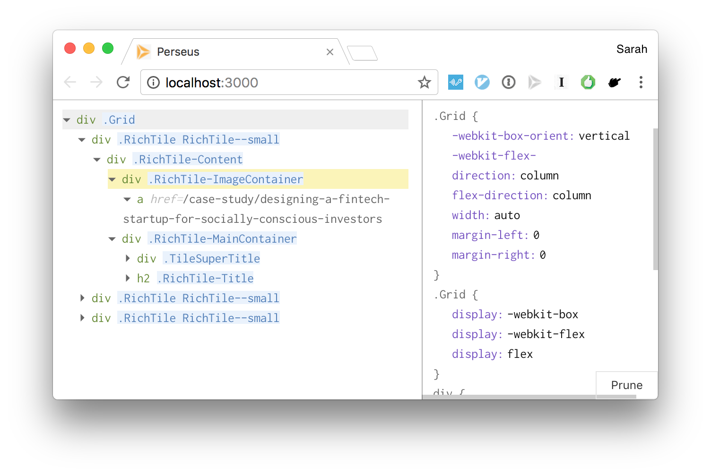

# Ply

Ply is a lightweight DOM and CSS inspector. It introduces novel CSS analysis techniques to help less-experienced developers inspect and learn from production websites of interest, when existing inspector interfaces are too overwhelming. Ply is research software, initially under development through [Design, Technology, and Research](http://dtr.northwestern.edu/projects/ply) at Northwestern University.

Several of Ply's core features have been released as [Inactive CSS](https://hacks.mozilla.org/2019/10/firefox-70-a-bountiful-release-for-all/#developertools) in [Mozilla Firefox](https://www.mozilla.org/en-US/firefox/new/) 70. Give it a try! You can also read our award-winning UIST 2018 paper, [Ply: A Visual Web Inspector for Learning from Professional Webpage](https://slim.computer/assets/papers/ply-uist.pdf), or watch the [talk](https://www.youtube.com/watch?v=n2dFxxBh2K4).



## Novel features

In order to help less-experienced developers navigate the complex DOM and CSS structures found on production webpages, Ply implements the following novel features:

- **Visual relevance pruning** (CHI 2017 SRC [paper](http://users.eecs.northwestern.edu/~scl025/files/ply.pdf), [talk](https://slides.com/soylentqueen/ply-chi-src/)): While inspecting the styles for an element, users can click a button to dynamically rule out styles with no visual impact on the page. Useful for reverse-engineering how certain visual effects are achieved, without wasting time on irrelevant properties.
- **Implicit dependencies** (UIST 2018 [paper](https://slim.computer/assets/papers/ply-uist.pdf), [talk](https://www.youtube.com/watch?v=n2dFxxBh2K4), [slides](https://slim.computer/ply-uist-2018/)): Many CSS properties depend upon each other in unintuitive ways (e.g. `z-index` does not apply if `position` is `static`). Ply uses visual relevance pruning to test for implicit dependencies, and provides explanatory tooltips to reinforce the relationships between properties.
- **DOM component isolation**: Rather than viewing the entire DOM at all times, users can select a node on the target webpage, and inspect only its subtree. Useful for inspecting a component of interest.

Additional features under development include:

- **Multiple element inspection**: Click on multiple elements in the DOM viewer to inspect their styles side-by-side. Useful for exploring parent-child relationships, positioning contexts, or many other interactions between CSS properties on distinct elements.
- **Style organization cues**: Using visual regression pruning, Ply can heuristically identify when a CSS rule serves as a "base style" for multiple elements on the page, and when another rule serves as a "refinement" style on top of shared base styles. Useful for understanding how professionals structure their CSS to minimize repetition and capture visual similarities and differences between elements.

## Design rationale

In our needfinding studies, less-experienced developers were frequently overwhelmed by the complexity of the Chrome Developer Tools Element interface.

Accordingly, Ply's user interface has been carefully designed to **minimize visual clutter** and extraneous cognitive load:

- **Truncated content**: Long text nodes are truncated by default in the DOM view, with the option to expand their contents.
- **No closing tags**: DOM nodes are displayed Python-style, with no closing tags. Indentation dictates the node hierarchy.
    + By not rendering closing tags, we cut vertical screen space by up to 50% for block-level elements.
- **Nodes are collapsed by default**: When a user selects a node for inspection, very rarely do they want to see the entire subtree at once. Ply collapses DOM nodes by default, allowing the user to explore the DOM structure step-by-step, at their own pace.
    + **Auto-expansion**: Container elements, which wrap a single child for styling purposes, frequently confused users in testing. Namely, users would neglect to expand container nodes, missing large portions of the DOM as a result. When a user expands a DOM node with a single child element, Ply will *auto-expand* its child recursively, until reaching a leaf node or an element with multiple children.

## Structure

This repository only includes the Ply frontend and proxy server. The system communicates with the target webpage via the Chrome Remote Debugging Protocol; all browser-facing functionality is located in the [chrome-remote-css](https://github.com/sarahlim/chrome-remote-css) repository.

The prototype implementation of the visual regression pruning algorithm can be found in [chrome-remote-css](https://github.com/sarahlim/chrome-remote-css) as well.

## Getting started

> The following instructions assume familiarity with Git and Node.js tooling. If you're not even sure how to download this project, check out [this guide](https://gist.github.com/sarahlim/ab4a31c822f93995806b29270f1faa7e) to get up to speed.

Install the [chrome-remote-css](https://github.com/sarahlim/chrome-remote-css) extension. Ply depends on this extension to debug pages remotely.

Once you've cloned this repository:

```sh
yarn install     # install dependencies
yarn run server  # start the proxy server
yarn start       # start the inspector
```

Then navigate to `http://localhost:3000` in Chrome, and you should have a blank inspector.

To start inspecting a webpage, open a new window or tab, and navigate to the site you want to inspect.

Click the browser extension icon to activate `chrome-remote-css`, and select an element on the page using the cursor. The element and its subtree should appear in Ply.

Note that you'll need to keep the inspection target tab open, so that Ply can update and request CSS styles as you inspect.

Please file an issue if you encounter any difficulties running the project.

