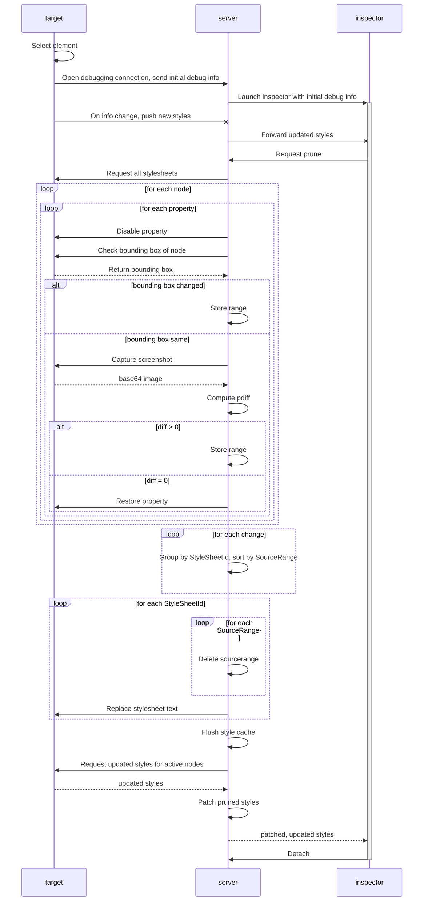
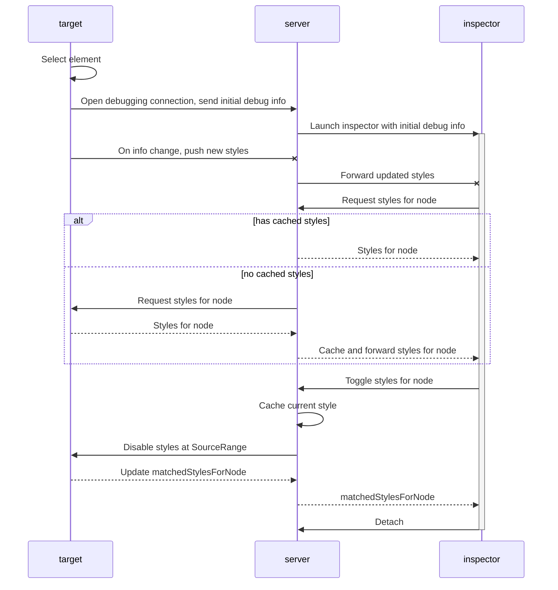

## Pruning

[Link](https://knsv.github.io/mermaid/live_editor/#/view/c2VxdWVuY2VEaWFncmFtCiAgICBwYXJ0aWNpcGFudCB0YXJnZXQKICAgIHBhcnRpY2lwYW50IHNlcnZlcgogICAgcGFydGljaXBhbnQgaW5zcGVjdG9yCgogICAgdGFyZ2V0IC0-PiB0YXJnZXQ6IFNlbGVjdCBlbGVtZW50CiAgICB0YXJnZXQgLT4-IHNlcnZlcjogT3BlbiBkZWJ1Z2dpbmcgY29ubmVjdGlvbiwgc2VuZCBpbml0aWFsIGRlYnVnIGluZm8KICAgIHNlcnZlciAtPj4rIGluc3BlY3RvcjogTGF1bmNoIGluc3BlY3RvciB3aXRoIGluaXRpYWwgZGVidWcgaW5mbwogICAgCiAgICB0YXJnZXQgLXggc2VydmVyOiBPbiBpbmZvIGNoYW5nZSwgcHVzaCBuZXcgc3R5bGVzCiAgICBzZXJ2ZXIgLXggaW5zcGVjdG9yOiBGb3J3YXJkIHVwZGF0ZWQgc3R5bGVzCgogICAgaW5zcGVjdG9yIC0-PiBzZXJ2ZXI6IFJlcXVlc3QgcHJ1bmUKICAgIHNlcnZlciAtPj4gdGFyZ2V0OiBSZXF1ZXN0IGFsbCBzdHlsZXNoZWV0cwogICAgbG9vcCBmb3IgZWFjaCBub2RlCiAgICAgICAgbG9vcCBmb3IgZWFjaCBwcm9wZXJ0eQogICAgICAgICAgICBzZXJ2ZXIgLT4-IHRhcmdldDogRGlzYWJsZSBwcm9wZXJ0eQogICAgICAgICAgICBzZXJ2ZXIgLT4-IHRhcmdldDogQ2hlY2sgYm91bmRpbmcgYm94IG9mIG5vZGUKICAgICAgICAgICAgdGFyZ2V0IC0tPj4gc2VydmVyOiBSZXR1cm4gYm91bmRpbmcgYm94CiAgICAgICAgICAgIGFsdCBib3VuZGluZyBib3ggY2hhbmdlZAogICAgICAgICAgICAgICAgc2VydmVyIC0-PiBzZXJ2ZXI6IFN0b3JlIHJhbmdlCiAgICAgICAgICAgIGVsc2UgYm91bmRpbmcgYm94IHNhbWUKICAgICAgICAgICAgICAgIHNlcnZlciAtPj4gdGFyZ2V0OiBDYXB0dXJlIHNjcmVlbnNob3QKICAgICAgICAgICAgICAgIHRhcmdldCAtLT4-IHNlcnZlcjogYmFzZTY0IGltYWdlCiAgICAgICAgICAgICAgICBzZXJ2ZXIgLT4-IHNlcnZlcjogQ29tcHV0ZSBwZGlmZgogICAgICAgICAgICAgICAgYWx0IGRpZmYgPiAwCiAgICAgICAgICAgICAgICAgICAgc2VydmVyIC0-PiBzZXJ2ZXI6IFN0b3JlIHJhbmdlCiAgICAgICAgICAgICAgICBlbHNlIGRpZmYgPSAwCiAgICAgICAgICAgICAgICAgICAgc2VydmVyIC0-PiB0YXJnZXQ6IFJlc3RvcmUgcHJvcGVydHkKICAgICAgICAgICAgICAgIGVuZAogICAgICAgICAgICBlbmQKICAgICAgICBlbmQKICAgIGVuZAoKICAgIGxvb3AgZm9yIGVhY2ggY2hhbmdlCiAgICAgICAgc2VydmVyIC0-PiBzZXJ2ZXI6IEdyb3VwIGJ5IFN0eWxlU2hlZXRJZCwgc29ydCBieSBTb3VyY2VSYW5nZQogICAgZW5kCgogICAgbG9vcCBmb3IgZWFjaCBTdHlsZVNoZWV0SWQKICAgICAgICBsb29wIGZvciBlYWNoIFNvdXJjZVJhbmdlCiAgICAgICAgICAgIHNlcnZlciAtPj4gc2VydmVyOiBEZWxldGUgc291cmNlcmFuZ2UKICAgICAgICBlbmQKICAgICAgICBzZXJ2ZXIgLT4-IHRhcmdldDogUmVwbGFjZSBzdHlsZXNoZWV0IHRleHQKICAgIGVuZAoKICAgIHNlcnZlciAtPj4gc2VydmVyOiBGbHVzaCBzdHlsZSBjYWNoZQogICAgc2VydmVyIC0-PiB0YXJnZXQ6IFJlcXVlc3QgdXBkYXRlZCBzdHlsZXMgZm9yIGFjdGl2ZSBub2RlcwogICAgdGFyZ2V0IC0tPj4gc2VydmVyOiB1cGRhdGVkIHN0eWxlcwogICAgc2VydmVyIC0-PiBzZXJ2ZXI6IFBhdGNoIHBydW5lZCBzdHlsZXMKICAgIHNlcnZlciAtLT4-IGluc3BlY3RvcjogcGF0Y2hlZCwgdXBkYXRlZCBzdHlsZXMKICAgIAogICAgaW5zcGVjdG9yIC0-Pi0gc2VydmVyOiBEZXRhY2g)

## Requesting and toggling styles

[Diagram](https://knsv.github.io/mermaid/live_editor/#/view/c2VxdWVuY2VEaWFncmFtCiAgICBwYXJ0aWNpcGFudCB0YXJnZXQKICAgIHBhcnRpY2lwYW50IHNlcnZlcgogICAgcGFydGljaXBhbnQgaW5zcGVjdG9yCgogICAgdGFyZ2V0IC0-PiB0YXJnZXQ6IFNlbGVjdCBlbGVtZW50CiAgICB0YXJnZXQgLT4-IHNlcnZlcjogT3BlbiBkZWJ1Z2dpbmcgY29ubmVjdGlvbiwgc2VuZCBpbml0aWFsIGRlYnVnIGluZm8KICAgIHNlcnZlciAtPj4rIGluc3BlY3RvcjogTGF1bmNoIGluc3BlY3RvciB3aXRoIGluaXRpYWwgZGVidWcgaW5mbwogICAgCiAgICB0YXJnZXQgLXggc2VydmVyOiBPbiBpbmZvIGNoYW5nZSwgcHVzaCBuZXcgc3R5bGVzCiAgICBzZXJ2ZXIgLXggaW5zcGVjdG9yOiBGb3J3YXJkIHVwZGF0ZWQgc3R5bGVzCgogICAgaW5zcGVjdG9yIC0-PiBzZXJ2ZXI6IFJlcXVlc3Qgc3R5bGVzIGZvciBub2RlCiAgICBhbHQgaGFzIGNhY2hlZCBzdHlsZXMKICAgICAgICBzZXJ2ZXIgLS0-PiBpbnNwZWN0b3I6IFN0eWxlcyBmb3Igbm9kZQogICAgZWxzZSBubyBjYWNoZWQgc3R5bGVzCiAgICAgICAgc2VydmVyIC0-PiB0YXJnZXQ6IFJlcXVlc3Qgc3R5bGVzIGZvciBub2RlCiAgICAgICAgdGFyZ2V0IC0tPj4gc2VydmVyOiBTdHlsZXMgZm9yIG5vZGUKICAgICAgICBzZXJ2ZXIgLS0-PiBpbnNwZWN0b3I6IENhY2hlIGFuZCBmb3J3YXJkIHN0eWxlcyBmb3Igbm9kZQogICAgZW5kCgogICAgaW5zcGVjdG9yIC0-PiBzZXJ2ZXI6IFRvZ2dsZSBzdHlsZXMgZm9yIG5vZGUKICAgIHNlcnZlciAtPj4gc2VydmVyOiBDYWNoZSBjdXJyZW50IHN0eWxlCiAgICBzZXJ2ZXIgLT4-IHRhcmdldDogRGlzYWJsZSBzdHlsZXMgYXQgU291cmNlUmFuZ2UKICAgIHRhcmdldCAtLT4-IHNlcnZlcjogVXBkYXRlIG1hdGNoZWRTdHlsZXNGb3JOb2RlCiAgICBzZXJ2ZXIgLS0-PiBpbnNwZWN0b3I6IG1hdGNoZWRTdHlsZXNGb3JOb2RlCgogICAgaW5zcGVjdG9yIC0-Pi0gc2VydmVyOiBEZXRhY2g)

