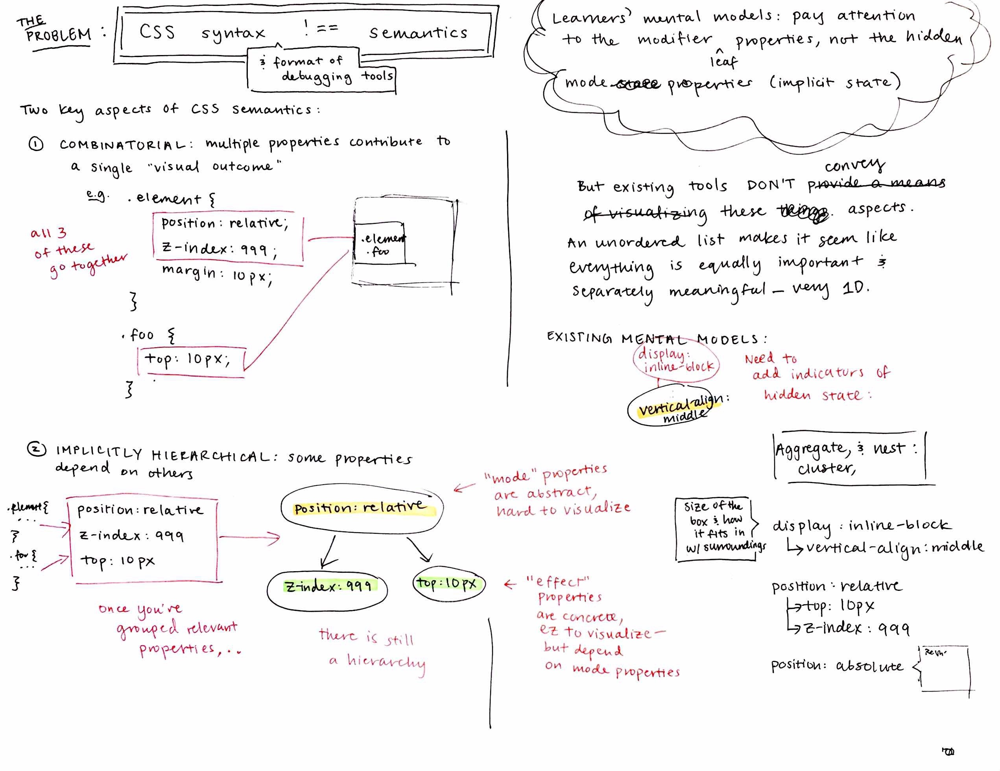
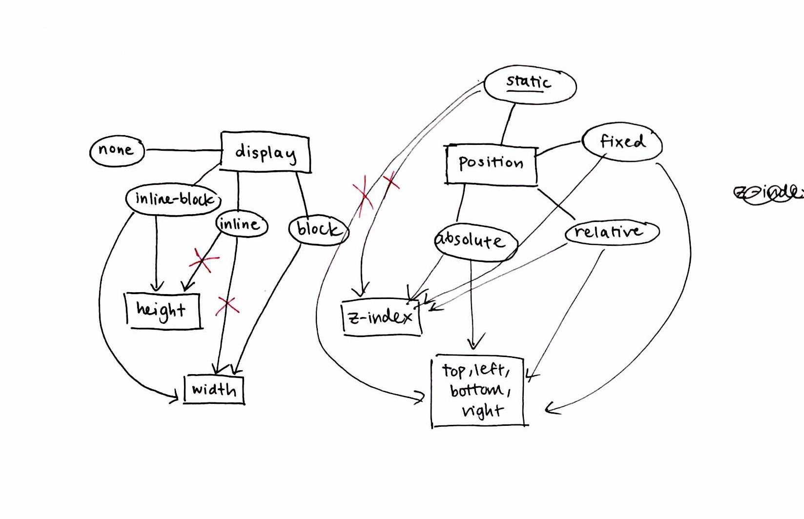
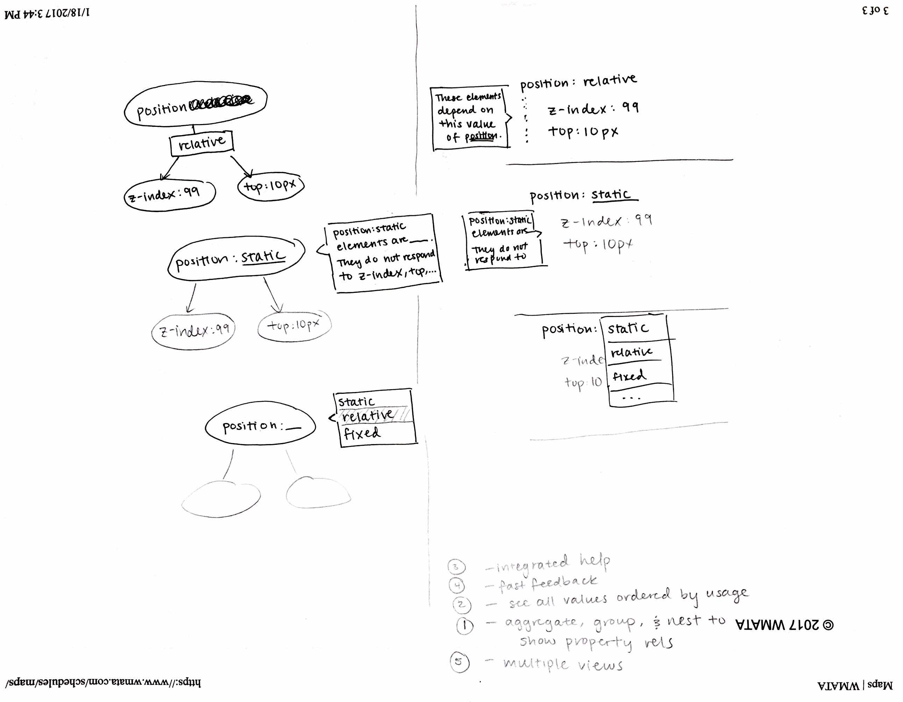
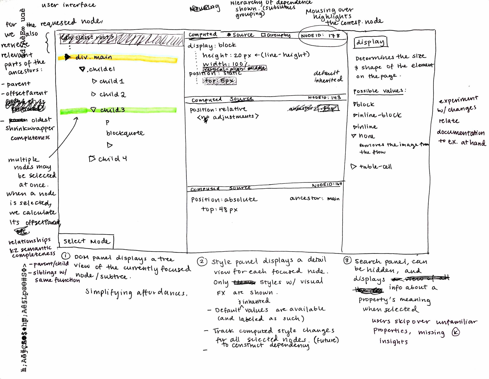
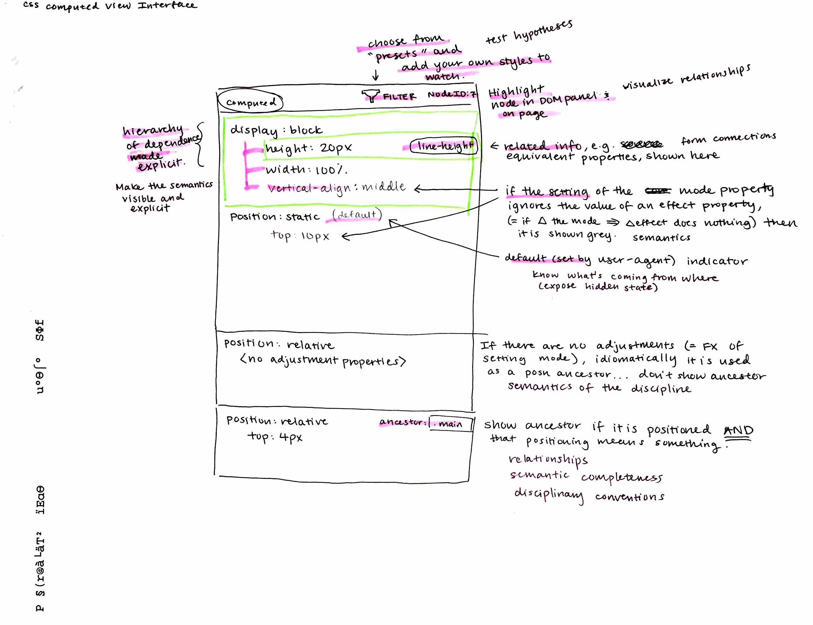

<!-- file:///Users/sarah/writing/research/Telescope%20Example%20(1).pdf -->
<!-- https://docs.google.com/document/d/1jdP9obLnkK7Ipy1otaKn6Stl90xZPrRdRWCnqMenDYc/edit# -->

# Develop practical argument (for all stakeholders)

## Identify a design situation

### Who are the users?

*End-user programmers* and *advanced beginner* web developers are familiar with the basic syntactic forms of HTML and CSS (tags, selectors, blocks), but unfamiliar with more advanced syntax (complex selectors, certain abstract-sounding properties) and all but the most basic underlying concepts (the difference between text and block elements, CSS selector specificity, etc.).

Our project targets users who are advanced beginners in web development specifically. Users may or may not have prior programming experience in other languages and paradigms.

<!-- NB: The last stipulation is based on results from the DTR in-class survey. Might need to make this definition a bit more rigid. -->

### What are their high level tasks and goals?

Both end users and advanced beginners aim to complete their existing web development projects. These users aim to learn the minimum necessary to successfully implement their envisioned outcomes. In addition, advanced beginner web developers may aim to keep their skills up-to-date with current standards (Dorn 2013).

## Test whether this is a design problem (i.e. requires a design solution)

### Are users struggling to accomplish their goals (what are their struggles?)

This is pretty uncontroversial. Users empirically adopt a trial-and-error approach to CSS inspection and debugging. Without an accurate mental model, trial and error is laborious, and success does not imply understanding. *"I dont think about how CSS really work," "I waste so much time just trying + trying + trying different things until I have some stroke of luck + get it. I don’t learn anything this way -- getting it had no reflection on my level of understanding.", "I’ve never tried to fully understand how it works"*.

### Are these struggles the result of a design challenge?

Partially. CSS semantics are inherently challenging to grasp because the language is *combinatorial* and *hierarchical*. CSS syntax (and existing debugger interfaces) fail to convey either of these qualities, since styles are displayed in a one-dimensional list.

### Can the problem already be solved with current technology?

Traditional approaches for learning CSS (books, tutorials, extensive trial and error) are extremely time intensive and not customized to the user's particular task. Existing developer tools do not adequately support *semantic* understanding. In our needfinding studies with the Chrome DevTools, showing the full DOM hierarchy and CSS cascade overwhelmed novice developers searching for relevant code: *"When I first looked at it, I didn't know how to make this useful, and I still don't really know..."*

## Describe broader impact

### Who is the practical audience?

End-user programmers, programmers without web development experience, individuals interested in learning HTML and CSS as a useful or employable skill.

### Why do they care (is this problem important?)

According to my CHI reviewers, yes. More seriously, CSS is as ubiquitious as the web, yet very few individuals understand how to implement CSS layouts correctly. The potential audience is enormous.

### What’s your problem statement? (Does it capture a core tension? Agent wants X but Y)

Inexperienced web developers want to effectively implement and debug web designs, but no resources exist for semantic debugging and other resources are too time-consuming or generic.

## Describe desired outcome

### What’s a real example of what a user wants to do? (Concrete user class / scenario)

Stella is an end-user who has previously made tweaks to HTML and CSS Tumblr themes. This is extremely impressive, because Stella is a dog. While browsing the web, Stella notices some text partially overlapping a solid-colored rectangular background, and finds the effect aesthetically pleasing. She decides to inspect the page to understand how to implement the effect on her own blog.

### What should users do? (And what should happen when they do it?)

1. (A1: Feature Location, DOM) Isolate the DOM nodes relevant to the desired effect.
2. (A1: Feature Location, CSS) For each node, view the CSS styles responsible for the effect.
3. (A2: Semantic Exploration) Understand how the styles relate (combinatorially and hierarchically) to produce corresponding visual outcomes.
4. (A3: Transfer) Apply relevant pieces of the effect to the user's own implementation scenario.

## Describe core obstacles

### Where can designs go wrong? What may prevent a user from reaching their goal?

1. (B1: Information Density; B2: Disciplinary Idioms) Inexperienced users may have trouble navigating the *information-dense DOM hierarchy*. Lack of familiarity with web development idioms (e.g. invisible container elements) may cause users to miss important information necessary to solve their problem.
2. (B3: Cognitive Load) On complex websites, the *cascade of matched styles may be very large* for a single DOM node, making it difficult for users to locate the relevant code. Object-oriented styles (and their corresponding selectors) are difficult for users to understand because they *lack a clear semantic association*.
3. (B3: Cognitive Load; B4: Hidden State) Styles are presented *one-dimensionally and in disjoint sets*, giving the impression that properties are mutually independent. Some property or value *names may be too abstract, actively misleading, or very similar*. To manage cognitive load, users typically ignore unfamiliar properties or syntax, which often contains crucial information.
4. (B5: Context Dependence) Not only do people suck at transfer in general, CSS *implementations are incredibly context-dependent*. A different usage scenario might require entirely different styles (although with modern CSS this is becoming less true).

## Describe design intervention

### What are the core characteristics of your design?

Instructional inspector design bridges problems in *information visualization* and *semantic representation for guided discovery learning*. Our design principles draw from Quintana et al.'s guidelines for promoting disciplinary *sensemaking* in educational software design.

1. (C1: Controlled Reveal) **Intelligently limit the information shown** at any point in time, **giving the user control** over gradual increases in informational fidelity.
2. (C2: Semantic Representation) **Make relationships and state explicit** through semantically appropriate representational strategies.
3. (C3: Low-Barrier Experimentation) **Provide easily malleable representations** so that users can quickly test their mental models with minimal overhead.
4. (C4: Disciplinary Awareness) To the extent possible, features should adapt to **common disciplinary idioms**, and make these idioms explicit to the user.

## Constructing arguments

### Why would the design work?

|      Design characteristic      |         Facilitated outcome(s)         |            Obstacle(s) addressed            |
| ------------------------------- | -------------------------------------- | ------------------------------------------- |
| C1: Controlled Reveal           | A1: Feature Location                   | B1: Information Density; B3: Cognitive Load |
| C2: Semantic Representation     | A2: Semantic Exploration, A3: Transfer | B4: Hidden State, B5: Context Dependence    |
| C3: Low-Barrier Experimentation | A2: Semantic Exploration, A3: Transfer | B3: Cognitive Load, B4: Hidden State        |
| C4: Disciplinary Awareness      | A1: Feature Location                   | B2: Disciplinary Idioms, B4: Hidden State   |

## Write the design argument

### What is your conceptual approach to solving the problem?

Concise one sentence statement of desired outcome, intervention, and why it should work (summarize Q9, Q12, Q13)

By presenting information about the inspected webpage in (1) manageable, user-controlled quantities which (2) map directly to the underlying semantics of the domain, users can build more accurate and sophisticated mental models of how HTML and CSS code produce visual outcomes.

### What is your design argument?

Our prototype aims to overcome two key interface limitations of the existing Chrome DevTools:
1. Only a single element may be inspected at a time. This makes it difficult for users to see layouts and relationships between elements.
	1. **By inspecting multiple elements simultaneously, users can more easily understand the relationships between different elements, as well as CSS properties which rely on other elements.**
2. For a single element, all of the CSS styles are shown without any semantic visual aids.
	1. **By seeing CSS properties grouped by relevance with respect to visual outcomes, users can more easily understand the meaning and usage of CSS properties.**

Our high level design argument is that **explicitly representing the relational and combinatorial aspects of CSS will help users form more accurate mental models**.

## Check your arguments

### Will your design work? Is it novel?

#### Might the design fail due to an unaccounted obstacle? If so, go back to step 5.

- May need more than a tree to show cyclic CSS dependencies, and more complicated semantics.
- Multiple selection can quickly overwhelm users; need a clear way of isolating precisely the relevant CSS.

#### Do arguments address all the core obstacles? If not, go back to step 6.

Currently missing a robust solution to the transfer problem. Have some ideas for mitigation strategies, but none satisfactory.

#### Are arguments based on literature (e.g., established theory or practical evidence)? If not go back to step 7.

Yes -- design principles informed by Quintana as stated above; see also Linn (cited by Quintana). Our approach to cognitive load follows theory on *extraneous cognitive load* (see Harms 2013 and others, my BibTeX extension is broken right now, along with the rest of my life). Shaffer and Resnick talk about disciplinary authenticity. There is an especially nice discussion of design principles for end user programming environments and minimalist learning theory in a 2016-ish Andy Ko paper. Lastly, functional programming educators and advocates have written extensively on the perils of mutable state and the corresponding benefits of referential transparency and isomorphisms between programs and data, much of which applies here.

#### Is design very similar to existing system? If similar go back to Q5.

Comparable tools include WebCrystal, the Chrome DevTools, and Firefox Developer Tools. WebCrystal has a number of technical shortcomings documented in my Ply paper, but actually I need to think more about this -- to complete later. For now, though, we are going lower-level than WebCrystal, and tackling more complex effects (WebCrystal does layout but mostly excels at 1-to-1 effects)

Chrome and FF DX folks are primarily focused on JavaScript tooling. There's nothing close for CSS.

# Build conceptual model

## Formulate interface arguments

### What are interface challenges for realizing your design arguments? 

1. **Problem statement:** There is too much information to show, and not all of it is relevant to the task at hand. I can't even hold all of these shannons and I don't know where to look.
    
    **Why important:** Understanding new semantics imposes significant (germane) cognitive load already. We want to minimize extraneous cognitive investment, and provide scaffolding rather than a completely open-ended discovery learning environment.

    **Desired outcome:** Users should be able to only show code and state relevant to their current information-seeking task.

    **Core obstacles:** Tasks may not be well-defined (the user may not even know what they are looking for), which makes eliciting and filtering information more difficult. Screen space limits the amount of information we can feasibly show, and it's important for this to work on 13" laptop monitors.

2. **Problem statement:** In high CL situations, users tend to ignore unfamiliar terms instead of context-switching to look them up. This leads to overlooking crucial sources of information relevant to the user's task.
    
    **Why important:** Integrating low-barrier, simple lookup for CSS properties and terms increases the likelihood that users will catch meaningful information. (NB: Hypothesis -- given a property with a promising-looking "clue," e.g. a color value matching the color of the information at hand, are users less likely to pay attention to it if it is surrounded by unfamiliar selectors/context?)

    **Desired outcome:** Users should be able to see definitions for terms, possible values for enumerated types, and how terms differ from similar terms, all inline/without leaving the view.

    **Core obstacles:** Context-aware hints face the same challenges as inferring a user's intentions. Not sure how to allow users to "pin" hints for continued reference.

3. **Problem statement:** Since many different sources of information affect the flow of CSS, there many be too much information to display at any point in time, or the solution may be cyclical and not offer a clear visual form.
    
    **Why important:** Visualization is a fundamental modality for conveying complex relationships. Because the semantics of CSS are highly complex and combinatorial, visual organizers help students relate disjoint behaviors to a unified mental model.

    **Desired outcome:** Users should be able to understand the sources and propagation flows of effect in CSS, from both DOM nodes and context, matched styles, and inherited styles. Oh god, this sounds impossible just writing this.

    **Core obstacles:** There are many combinations of possible interactions. Designing a unique visual identifier for each "class" or entity runs the risk of overwhelming users, just as before. We need a way to reduce the complexity of the CSS effect graph to simplest form, then translate that graph into a coherent visualization.

### What are your interface solutions & arguments?

|           Feature            |                                    Argument                                   |
| ---------------------------- | ----------------------------------------------------------------------------- |
| DOM search heuristics        | Show users nodes they might have missed, teach layout conventions             |
| DOM folding w/ graph minor   | Graph minor induced on selected nodes "prunes" the DOM tree                   |
| CSS DAG visualization        | Can at least show DAG-able property relationships                             |
| Breadth first tree expansion | Allow users to control the rate at which information is shown and hidden      |
| Information cursor mode      | Allow users to query reputable sources without context-switching              |
| Multiple selection           | Allow users to compare/contrast styles, or inspect parent/child relationships |
| Preloaded value recipes           | Allow users to see common use cases and combinations of properties |

### Does your interface solution work? Apply Q16 to the interface problem. Note all potential issues.

- **Might the design fail due to an unaccounted obstacle? If so, go back to step 5.**
	- May need more than a tree to show cyclic CSS dependencies, and more complicated semantics.
	- Multiple selection can quickly overwhelm users; need a clear way of isolating precisely the relevant CSS.
- **Do arguments address all the core obstacles? If not, go back to step 6.**
	- It's still unclear how we'll visualize and scale multiple inspection for several nodes, complex semantics, etc. but currently aiming to address a subset of those problems.
- **Are arguments based on literature (e.g., established theory or practical evidence)? If not go back to step 7.**
	- Bret Victor's "Learnable Programming," "Up and Down the Ladder of Abstraction."
	- Scheiderman's mantra for information visualization, "Overview first, zoom and filter, then details on demand."
- **Is design very similar to existing system? If similar go back to Q5.**
	- No existing interface supports multiple inspection of elements. Current visualizations extend to the box model, but that's pretty much it.

## Build the interface model

### From the user perspective, how does the system work?
#### Journey map (capture goals/scenarios)
[JS Bin - Collaborative JavaScript Debugging](https://jsbin.com/cayawad/edit?css,output)

1. I want to understand why this box isn't vertically aligned.
2. I set `vertical-align: center`, but nothing happens.
3. I notice that `center` is not a valid keyword for `vertical-align`. When I click on the warning, it shows the list of possible values: `middle` is what I want. I choose this value.
4. I notice that `display: block` , the default setting for a `
`, is causing the linkage to `vertical-align` to be ignored. I click it and see that it would need to be `display: inline-block` or `display: table`. I choose `display: inline-block`. I see that `vertical-align` affects the *contents* of a container, so I drag the property onto the parent.
5. Now the flow is activated from `display` to `vertical-align: middle`, and the element aligns itself vertically.
[answer here] 
    please include journey map screenshots+commentary 

#### Storyboard (capture flow and core characteristics)
1. Selection mode: select an element on the debugging target
2. DOM traversal panel: expand nodes breadth first, according to their position on the page.
3. CSS selection panel: view CSS styles at a glance, along with preset "filters" for properties.
4. Explanation panel: can be hidden on demand, and displays additional information about a property's meaning when selected.

#### Interface prototype (capture affordances for achieving high-level goals)
    [answer here]
        please include interface prototype screenshots+commentary 

### Does the interface solve the user’s problem?

* *Does interface map onto design argument?* Partially. The current implementation needs to do more to support malleability/experimentation, transfer, etc. We still have a ways to go in developing effective visualization techniques for complex semantic data.
* *Does interface map onto interface arguments?* I'm not sure what this means because I feel like the interface arguments are descriptions and justifications of each interface feature. In that sense, I would say that our plans do align with the interface arguments.

## Formulate system arguments

### What are technical challenges for realizing the interface model?

*NB: The following technical challenges are not Unsolved Problems per se, but they are technical challenges for* me personally *given my existing skills and technical knowledge.*

1. Live debugging of arbitrary targets
2. Formalizing and encoding complex CSS semantic logic
3. Creating tractable visualizations of CSS semantics
4. Managing fast stylesheet mutation without allowing components to get out of sync with one another and the remote DOM

### What are the technical solution & arguments?

1. Chrome extension and socket.io server together expose an interface over the local network for making requests against the debugger API, serving connections from any application with a socket.io client.
2. Runtime checking based on Ply is a partial solution, but not especially performant. There are ways to optimize by checking quadtrees produced by the Layout agent and possibly by subscribing to reflow notifications, need to look into this more. Based on these encodings, we can construct a (D?)(A?)G depicting the flow of causality across the inspected properties. Using this DAG, we *should* be able to render a visualization using existing graphing libraries.
3. Transitioning to a state management container such as Redux will allow us to batch read and writes and keep the DOM in sync.

### Does your technical solution work? Apply Q16 to the technical problem. Describe all potential issues.

- **Might the system fail due to an unaccounted obstacle? If so, go back to step 5.**
	- Yes, we may have problems managing asynchronous edit operations on the DOM. We plan to refactor the application to use Redux for predictable state management, and introduce batched CSS updates.
- **Do arguments address all the core obstacles? If not, go back to step 6.**
	- Once we have demonstrated the feasibility of our solution for a subset of properties (e.g. those related to layout and positioning), we need to consider a generalizable approach to resolving the semantic DAG when the browser computes CSS styles.
- **Are arguments based on literature (e.g., established theory or practical evidence)? If not go back to step 7.**
	- Very little work has been done on CSS semantics, but this approach is loosely based on Cassius (POPL 2016) and that long French paper from 2011.
- **Is design very similar to existing system? If similar go back to Q5.**
	- Our technical contribution will be the development of performant algorithms for constructing the semantic graph of properties. 

## Build the system model

### How does the system actually work?

#### Architecture diagram (capture system design)
[answer here]
            please include diagram + description

#### Technical storyboard (illustrate technique via step-by-step walkthrough)
1. Socket proxy server starts, creating namespaces for browsers and frontends
2. Activating the extension attaches a socket.io client to the current debugging target, and connects to the browser namespace
3. Client application includes a socket.io client, which connects to the frontend namespace.
4. Client layer serializes and identifies requests for data (nodes, styles, etc.) and sends them to the server.
5. Server forwards the request to the browser.
6. Browser queries the `chrome.debugger` protocol asynchronously, and handles the result by dispatching a response to the server with the same id.
7. Server forwards the response to the frontend.
8. Frontend updates the application root state, and propagates change down to child components.

#### Proof of concept (demonstrate feasibility of technical solution)
See video

### Does the system solve the technical challenges?

- *Does system map onto design argument?* Yes, it decouples the debugging target connection from the frontend and allows inspection to "freeze" a certain point in time.
- *Does system map onto technical arguments?* Yes, it enables debugging of arbitrary targets and could be generalized to other browsers.

# Study Design

> These notes "look ahead" to next steps for the following quarter.  

## Study Aims and Expected Outcomes

### What is the goal of conducting your study?

Understand how combinatorial and semantically-aware interface features help users understand CSS positioning and layout semantics.

### What research questions will your study answer?

1. (RQ1) How might we bridge the gap between one-dimensional representations of CSS, and its combinatorial semantics?
2. (RQ2) How does controlling the amount of content shown affect users' understanding of CSS layout and positioning concepts?

### What are your design arguments and claims going into the study?

1. (C1) By allowing users to inspect multiple elements simultaneously, and displaying features and information about these elements' potential relationships, users can understand properties which relate two different elements.
2. (C2) By limiting the amount of information shown and providing control to the user, users can understand CSS semantics more effectively by stepping through the process at their own rate.

### What are your measures for your design argument/claims?

1. (M1)
	1. Number of relational properties whose dependent elements can be seen simultaneously
	2. Number of multi-element layout techniques whose dependent elements can be seen simultaneously
2. (M2)
	1. Number of characters displayed at once necessary to convey the relevant concept (NB: this seems really jank, but I'm not sure how else to describe it)
	2. Time spent understanding a relational concept or layout

## Study Setup

### Who are your participants?

*Currently*: case studies only to prove technical feasibility

*Future*:
* Eight advanced beginners: at least 1 year of experience programming in other languages, 2 projects of CSS, pass a basic quiz
* Eight end user programmers: no formal programming experience in other languages, at least 1 year of end user programming with HTML and CSS, pass the same basic quiz
 
### What is the testing scenario?

*Currently*: case studies will be performed in one sitting.

*Future*:
- *What are the testing conditions?* Controlled within-subjects study.
- *When and where will they use the app?* Lab setting, with an external display. 
- *How often will they use the app, and how long at a time?:* Users will spend 30 minutes on each task; the entire process will take 1 hour and 15 minutes.  Users will be compensated \$40 for the time.
- *What are the dates of testing, and the total duration?* To be completed during week 3 of spring quarter.

### What high-level tasks will users be asked to perform?

*Currently*:
Case studies will test understanding of:
- The Bootstrap grid component
- A flexbox grid
- Fixed-position headers and footers on Tumblr and Twitter
- Decorative offsets on LoremIpsumGenerator

*Future*: Users will each reverse engineer two randomly selected features from the aforementioned list, once using CDT and once using Perseus.

## Data Collection

### What data will you collect to inform your measures for your claims?

1. (A1) How does understanding occur?
	1. *Describe how you will collect data?* Users will be asked to complete a multiple-choice survey in the lab during the task, in which they answer factual questions regarding the properties tested.
	2. *What specific data will you collect?* Users' survey responses, the number of correct answers, and the consistency in characterizations of particular semantic behaviors.
	3. *Which measures and claims does the collected data inform?*
		1. Understanding of relational properties with dependent elements
		2. Understanding of multi-element layout techniques with dependent elements
2. (A2) How does information content affect cognitive load affect understanding?
	1. *Describe how you will collect data?* Pre- and post-surveys on cognitive load (Kyle Harms said this was the most effective way to measure)
	2. *What specific data will you collect?* Likert scale rating of participants' comfort with the tool and cognitive load; time to first "key benchmark"
	3. *Which measures and claims does the collected data inform?*
		1. Number of characters displayed at once necessary to convey the relevant concept (NB: this seems really jank, but I'm not sure how else to describe it)
		2. Time spent understanding a relational concept or layout

# Findings
To be completed in more detail after the case study.

## Core Findings

### Concisely stated, what are your core findings?

### What are your core findings?

1. RQ1: How might we bridge the gap between one-dimensional representations of CSS, and its combinatorial semantics?
	1. Re-state core finding: [answer here]
	2. Provide evidence for core finding:
			1. [Please include any relevant tables, figures, charts, quotes, etc.]
	3. Evidence (a):
	4. Evidence (b):
	5. Evidence (c): 
2. RQ2: How does controlling the amount of content shown affect users' understanding of CSS layout and positioning concepts?
	1. Re-state core finding: [answer here]
	2. Provide evidence for core finding:
			1. [Please include any relevant tables, figures, charts, quotes, etc.]
	3. Evidence (a):
	4. Evidence (b):
	5. Evidence (c): 

### Implications on your design arguments and claims

- *Which parts of the design argument were correct?*
- *Which parts of the design argument were incorrect?*
- *Which parts of your design argument or claims couldn’t actually be tested with the data you collected?*
- *What new obstacles were encountered for reaching the desired outcomes?*

## Design Implications

### Based on your findings, what are your revised design arguments?

> Be precise in stating your new design argument and also why these changes are effective. Highlight changes to outcomes, obstacles, intervention, and arguments.  

### Based on your findings, how will your interface model change?

> Be precise in stating your new interface model and also why these changes are effective. Highlight changes to outcomes, obstacles, intervention, and arguments.  

    
### Based on your findings, how will your system model change?

> Be precise in stating your new system model and also why these changes are effective. Highlight changes to outcomes, obstacles, intervention, and arguments.  

### Based on your findings, how will your study design change?

> Be precise in stating changes to your study design and also why these changes  
are effective. Highlight changes to study aims, setup, and data collection.
